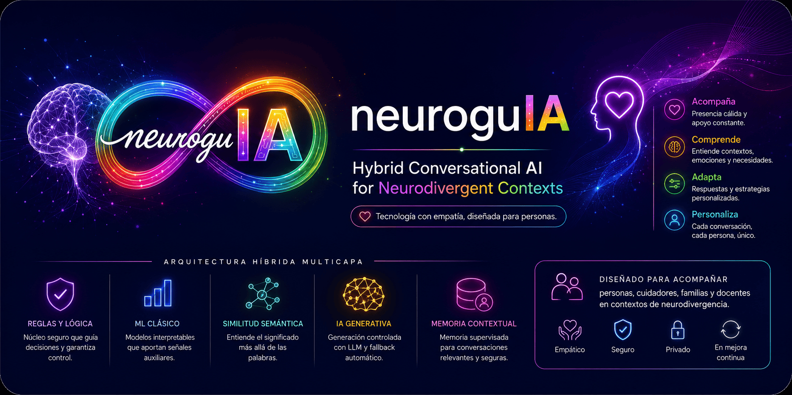

<p align="center">
  
</p>

# 🧠 neuroguIA

### Hybrid Conversational AI for Socioemotional Support in Neurodivergent Contexts


---

## 📖 Overview

**neuroguIA** is a hybrid conversational AI system focused on providing **socioemotional and functional support in neurodivergent contexts**, designed to accompany users, caregivers, families, and educators through adaptive, contextualized, and supervised conversational assistance.

The system combines multiple artificial intelligence approaches under a **safe, interpretable, and controlled architecture**, without replacing clinical or therapeutic attention.

---

## ✨ Core Capabilities

neuroguIA does not simply generate responses.  
It is designed to:

- interpret conversational intention
- identify functional and emotional states
- organize adaptive conversational flows
- provide contextualized support
- generate structured micro-actions and routines
- maintain contextual memory across interactions
- supervise conversational quality and safety

---

## 🧠 Conversational Interpretation

<p align="center">
  
</p>

The system includes mechanisms for:

- conversational intent classification
- functional category detection
- contextual semantic interpretation
- emotional signal processing
- adaptive routing and decision support

Supported states include:

- meltdown
- shutdown
- burnout
- executive dysfunction
- sensory overload
- emotional saturation

---

## 🏗️ Hybrid AI Architecture

<p align="center">
  
</p>

neuroguIA implements a multi-layer hybrid architecture composed of:

### 🔵 Rule-Based Core System

Internal logic responsible for:

- routing
- validation
- adaptive decision-making
- safety mechanisms
- fallback strategies

---

### 🟢 Classical Machine Learning

Interpretable baseline models using:

- TF-IDF
- Logistic Regression

These models are used as supportive signals rather than primary decision-makers.

---

### 🟣 Semantic Similarity & Embeddings

Implemented with:

- `sentence-transformers`
- model: `all-MiniLM-L6-v2`

This layer enables semantic understanding beyond keyword matching.

---

### 🟡 Controlled Generative AI

Optional integration with OpenAI through:

- `core/llm_gateway.py`

Features include:

- supervised response generation
- controlled prompting
- automatic fallback logic
- non-delegation of critical decisions to LLMs

---

### 🧠 Contextual Memory System

<p align="center">
  
</p>

The system incorporates:

- contextual session memory
- supervised memory persistence
- conversational curation
- reusable adaptive responses
- structured interaction history

---

## ⚙️ Main Features

<p align="center">
  
</p>

- intent classification
- category detection
- adaptive conversational routing
- emotional and functional state detection
- contextual memory
- supervised conversation curation
- reusable response memory
- multi-backend database support
- Streamlit interface
- hybrid NLP processing pipeline

---

## 🗄️ Database & Persistence

neuroguIA supports multiple persistence backends:

- SQLite
- PostgreSQL
- Supabase

The project includes structured schemas and modular persistence logic for conversational storage and contextual memory management.

---

## 📁 Project Structure

```text
neuroguIA/
├── app.py
├── validate_experiment.py
├── requirements.txt
├── schema_supabase.sql
├── README.md
├── .gitignore
├── assets/
├── core/
├── memory/
├── database/
├── scripts/
├── docs/
└── validation_outputs/
```

---

## 🧪 Project Status

Research prototype currently under active development and experimental validation.

The system continues evolving through iterative testing, conversational analysis, contextual evaluation, and supervised refinement.

---

## ⚖️ Ethical Considerations

neuroguIA does not replace medical, psychological, psychiatric, or therapeutic care.

The system was designed exclusively as a socioemotional accompaniment and functional support tool within educational and family environments related to neurodivergence.

All datasets and conversational records intended for academic or research purposes are anonymized prior to analysis and publication.

---

## 🔬 Research Areas

- Artificial Intelligence
- Conversational AI
- Natural Language Processing (NLP)
- Hybrid AI Systems
- Human-Centered AI
- Neurodivergence
- Socioemotional Support Technologies
- Adaptive Conversational Systems

---

## 👩‍💻 Author

**Cristhianne De León**  
M.Sc. Student in Artificial Intelligence

ORCID: https://orcid.org/0009-0007-4777-1741

[](https://doi.org/10.5281/zenodo.20337409)

---

## 📄 License

This project is distributed under the **CC BY-NC 4.0 License**.

Academic and research use is permitted with proper attribution. Commercial use is not allowed without explicit authorization.
