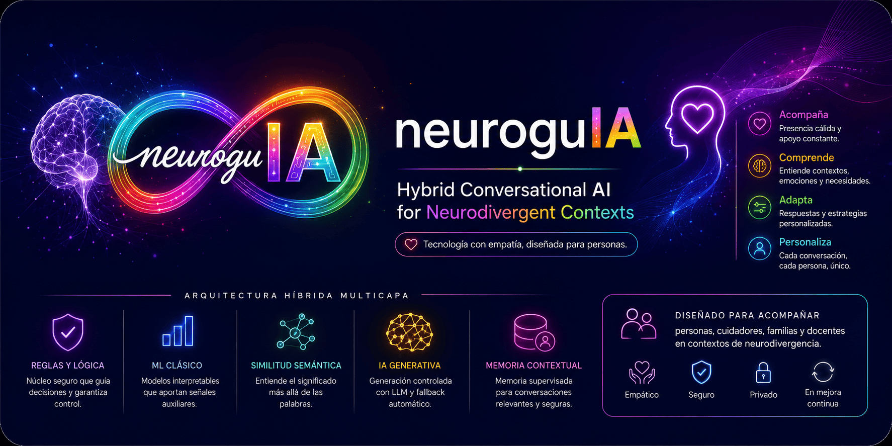

<p align="center">
  
</p>

# 🧠 neuroguIA

### Hybrid Conversational AI for Socioemotional Support in Neurodivergent Contexts


---

## 📖 Overview

**neuroguIA** is a hybrid conversational AI system designed to provide **socioemotional and functional support in neurodivergent contexts**, with particular emphasis on caregivers, families, educators, and people who require structured, contextualized, non-clinical accompaniment.

The system combines deterministic rules, classical machine learning, semantic retrieval, contextual memory, adaptive conversational routing, structured routines, and supervised generative AI within a controlled architecture.

neuroguIA is **not a medical, psychological, psychiatric, or therapeutic service** and does not replace professional care. Its purpose is socioemotional accompaniment, functional support, orientation, and organization within family and educational settings.

---

## 🎓 Thesis and Defense Baseline

This repository contains the implementation associated with the master's thesis:

**“Inteligencia Artificial basada en Procesamiento de Lenguaje Natural (PLN) para el apoyo socioemocional en contextos de neurodivergencia: diseño y validación en madres y cuidadores.”**

The architecture documented in the thesis is preserved as the **V14 baseline**.

For defense preparation, technical consolidation was performed in the branch:

```text
defensa-2026
```

These closing activities were limited to regression testing, reproducibility, persistence, conversational continuity, compatibility, and technical hardening. They **do not modify** the experimental design, sample, statistical results, historical versions, or scientific conclusions reported in the thesis.

Technical freeze documentation:

```text
docs/DEFENSE_FREEZE.md
docs/DEFENSE_TECHNICAL_STATUS.md
docs/SUPABASE_COMPATIBILITY.md
```

---

## ✅ Defense Validation Status

The defense validation gate is executed with:

```bash
python scripts/run_defense_checks.py
```

Current validated state:

```text
10/10 checks passed
DEFENSE STATUS: BASE VALIDATIONS PASSED
```

The automated checks are:

1. `thesis_contract`
2. `supabase_bridge_contract`
3. `functional_support`
4. `routine_delivery`
5. `routine_persistence`
6. `orchestrator_routine_persistence`
7. `routine_conversational_recall`
8. `routine_conversational_update`
9. `gateway_contract`
10. `conversation_continuity`

These checks verify technical behavior and regression safety. They are **not a new experimental validation** and do not replace the scientific analyses reported in the thesis.

GitHub Actions workflow:

```text
.github/workflows/defense-validation.yml
```

Validation evidence is generated under:

```text
validation_outputs/
```

and is also preserved as a GitHub Actions artifact.

---

## ✨ Core Capabilities

neuroguIA is designed to:

- interpret conversational intent;
- identify functional and emotional states;
- route conversations through adaptive decision logic;
- provide contextualized socioemotional support;
- generate structured micro-actions and routines;
- preserve contextual memory across interactions;
- recover and update previously stored routines;
- isolate persistent information by family and profile;
- supervise conversational quality and safety;
- use generative AI only as a controlled support layer;
- provide fallback behavior when external services are unavailable.

---

## 🧠 Conversational Interpretation

<p align="center">
  
</p>

The conversational pipeline includes mechanisms for:

- conversational intent classification;
- functional category detection;
- contextual semantic interpretation;
- emotional signal processing;
- adaptive routing;
- decision support;
- conversational continuity;
- safety and fallback handling.

The system can identify and reason about states or situations such as:

- meltdown;
- shutdown;
- burnout;
- executive dysfunction;
- sensory overload;
- emotional saturation;
- caregiver overload;
- school-related difficulties;
- routine and habit challenges.

---

## 🏗️ Hybrid AI Architecture — V14

<p align="center">
  
</p>

neuroguIA implements a multi-layer hybrid architecture.

### 🔵 Rule-Based Core

Deterministic and interpretable logic for:

- conversational routing;
- validation;
- safety mechanisms;
- adaptive decision-making;
- fallback strategies;
- functional support activation;
- routine activation and delivery.

### 🟢 Classical Machine Learning

Interpretable baseline models based on:

- TF-IDF;
- Logistic Regression.

These models provide classification signals and do not independently control critical decisions.

### 🟣 Semantic Similarity and Embeddings

Semantic processing is implemented with:

- `sentence-transformers`;
- embedding model: `all-MiniLM-L6-v2`.

This layer supports semantic similarity, retrieval, and contextual understanding beyond exact keyword matching.

### 🟡 Controlled Generative AI

OpenAI integration is handled through:

```text
core/llm_gateway.py
```

The implementation uses the OpenAI **Responses API** as a supervised generative layer.

Generative AI is used for:

- controlled drafting;
- conversational reformulation;
- selected response generation;
- continuity support.

Critical routing, safety, persistence, and context decisions are not delegated exclusively to the language model.

### 🧠 Contextual Memory

<p align="center">
  
</p>

The memory subsystem includes:

- family context;
- profile context;
- case memory;
- response memory;
- user-context memory;
- structured routines;
- conversational curation;
- reusable adaptive responses.

---

## 🧭 Functional Support

The consolidated functional layer includes seven main purposes:

- emotional regulation;
- school support;
- family organization;
- sensory regulation;
- caregiver well-being;
- crisis management;
- routines and habits.

The system also maintains internal state analysis, risk handling, and specialized conversational routes without conflating these with the seven functional purposes.

---

## 🔁 Persistent Routines and Continuity

neuroguIA can generate structured routines and persist them when valid family and profile context is available.

The persistence lifecycle validated for defense includes:

```text
message
  ↓
routine generation
  ↓
case association
  ↓
persistence
  ↓
session close
  ↓
later retrieval
  ↓
conversational recall
  ↓
conversational update
```

The system verifies that stored routines:

- remain associated with the correct family;
- remain associated with the correct profile;
- can be recovered in a later session;
- can be modified through natural-language interaction;
- preserve the same `routine_id` after updates;
- are not exposed to a different profile.

---

## 🗄️ Database and Persistence

neuroguIA supports:

- SQLite for local development and isolated testing;
- PostgreSQL/Supabase for structured production persistence.

Canonical production structures include:

```text
ng_families
ng_profiles
ng_messages
ng_case_memory
ng_response_memory
ng_user_context_memory
ng_routines
```

A compatibility bridge preserves selected historical internal names used by the local SQLite backend while mapping them to the canonical `ng_*` structures in PostgreSQL/Supabase.

Expected compatibility state:

```text
COMPATIBLE_WITH_BRIDGE
```

Further details:

```text
docs/SUPABASE_COMPATIBILITY.md
```

---

## ⚙️ Main Features

<p align="center">
  
</p>

- intent classification;
- functional category routing;
- emotional and functional state detection;
- contextual memory;
- profile-aware persistence;
- case memory;
- response memory;
- structured routines;
- routine persistence;
- conversational routine recall;
- conversational routine update;
- conversation continuity;
- supervised conversation curation;
- controlled generative AI;
- fallback logic;
- SQLite and PostgreSQL/Supabase support;
- Streamlit interface;
- scientific dashboard.

---

## 📁 Project Structure

```text
neuroguIA-conversational-ai/
├── .github/
│   └── workflows/
│       └── defense-validation.yml
├── assets/
├── core/
├── dashboard/
├── database/
├── docs/
├── memory/
├── scripts/
├── validation_outputs/
├── app.py
├── requirements.txt
├── schema_supabase.sql
├── secrets.toml.example
├── README.md
├── LICENSE
└── CITATION.cff
```

Key defense validation scripts include:

```text
scripts/run_defense_checks.py
scripts/validate_thesis_contract.py
scripts/validate_supabase_bridge_contract.py
scripts/validate_functional_support.py
scripts/validate_routine_delivery.py
scripts/validate_routine_persistence.py
scripts/validate_orchestrator_routine_persistence.py
scripts/validate_routine_conversational_recall.py
scripts/validate_routine_conversational_update.py
scripts/validate_gateway_contract.py
scripts/validate_conversation_continuity.py
```

---

## 🚀 Installation

### 1. Clone the repository

```bash
git clone https://github.com/CristhianneDeLeon/neuroguIA-conversational-ai.git
cd neuroguIA-conversational-ai
```

### 2. Create a virtual environment

Windows:

```bash
python -m venv .venv
.venv\Scripts\activate
```

Linux/macOS:

```bash
python -m venv .venv
source .venv/bin/activate
```

### 3. Install dependencies

```bash
python -m pip install --upgrade pip
pip install -r requirements.txt
```

### 4. Configure external services

Use the example configuration included in the repository as a reference.

Never commit real credentials.

Do **not** publish:

- `.env`;
- real `secrets.toml`;
- OpenAI API keys;
- Supabase service-role keys;
- passwords;
- JWTs or access tokens.

---

## ▶️ Run the Application

```bash
streamlit run app.py
```

Official public application:

https://neuroguia-ai.streamlit.app/

---

## 📊 Scientific Dashboard

Official scientific dashboard:

https://neuroguia-conversational-ai-dashboard.streamlit.app/

The dashboard is maintained as a separate Streamlit application and is intended to support visualization and interpretation of the study outputs.

---

## 🧪 Run the Defense Validation Gate

From the repository root:

```bash
python scripts/run_defense_checks.py
```

Expected result:

```text
Resultado general: 10/10 verificaciones superadas
ESTADO DE DEFENSA: VALIDACIONES BASE SUPERADAS
```

GitHub Actions automatically executes the same gate on the defense branch.

---

## 📦 Dataset

Public dataset repository:

https://github.com/CristhianneDeLeon/neuroguIA-dataset

Only anonymized and publication-approved research materials should be distributed publicly.

The source repository and the dataset repository must remain conceptually separated:

- this repository contains the conversational AI implementation;
- the dataset repository contains research data and reproducibility materials approved for dissemination.

---

## 🔬 Research Scope

The project is related to:

- Artificial Intelligence;
- Conversational AI;
- Natural Language Processing;
- Hybrid AI Systems;
- Human-Centered AI;
- Neurodivergence;
- Socioemotional Support Technologies;
- Adaptive Conversational Systems;
- Contextual Memory;
- Retrieval-Augmented Generation;
- Responsible AI.

---

## ⚖️ Ethical and Safety Considerations

neuroguIA does not replace:

- medical care;
- psychological care;
- psychiatric care;
- emergency services;
- psychotherapy;
- professional diagnosis.

The system is intended for non-clinical socioemotional accompaniment and functional support.

Sensitive records must not be published without appropriate anonymization and authorization.

No production credentials, personally identifiable information, or non-anonymized participant records should be included in the public repository.

---

## 🔐 Reproducibility and Security

Before distributing or archiving the repository:

- remove `.env` files;
- remove real Streamlit secrets;
- remove API keys and tokens;
- remove local databases containing identifiable information;
- remove temporary exports with personal data;
- retain only approved anonymized datasets;
- execute the defense validation gate;
- preserve the generated validation evidence.

---

## 🔗 Official Resources

**Conversational application**  
https://neuroguia-ai.streamlit.app/

**Scientific dashboard**  
https://neuroguia-conversational-ai-dashboard.streamlit.app/

**Source code**  
https://github.com/CristhianneDeLeon/neuroguIA-conversational-ai

**Dataset**  
https://github.com/CristhianneDeLeon/neuroguIA-dataset

**ORCID**  
https://orcid.org/0009-0007-4777-1741

---

## 👩‍💻 Author

**Cristhianne De León**  
Master's Student in Artificial Intelligence

ORCID:  
https://orcid.org/0009-0007-4777-1741

---

## 📚 Citation

Repository citation metadata is available in:

```text
CITATION.cff
```

Current Zenodo record:

[](https://doi.org/10.5281/zenodo.20337409)

When citing the software or dataset, use the corresponding software/dataset record rather than assigning the repository DOI to the thesis itself.

---

## 📄 License

This repository is distributed under the license included in:

```text
LICENSE
```

Current repository license:

**CC BY-NC 4.0**

Academic and research use is permitted with proper attribution. Commercial use is subject to the terms of the repository license.

---

## 🛡️ Defense Freeze

The defense baseline is considered technically frozen after successful execution of all required automated checks.

Current closing state:

```text
Architecture baseline: V14
Defense branch: defensa-2026
Automated technical checks: 10/10 PASSED
```

Any subsequent functional change should be treated as a new technical modification and must rerun the complete validation gate before being incorporated into a defense or archival release.
